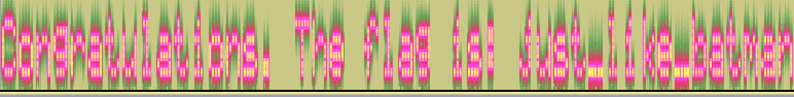

# Synesthesia

This problem is solved by viewing the included .wav file in a spectrograph. When visualized logarithmically, the tones spell out: `Congratulations. The flag is: just_like_batman`.

The flag is `just_like_batman`.
